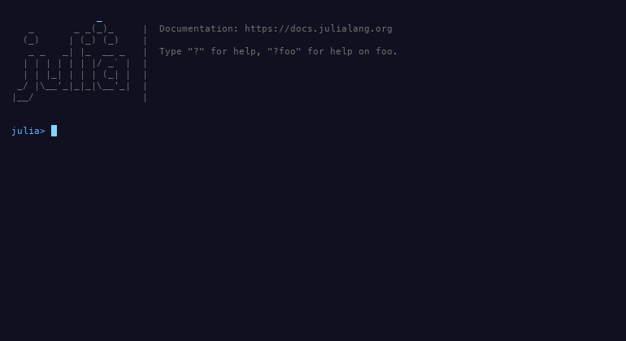

# LMFDBLite

A Julia interface to the [LMFDB](https://www.lmfdb.org/), with optional
[Hecke](https://github.com/thofma/Hecke.jl) and
[Oscar](https://github.com/oscar-system/Oscar.jl) support for constructing
number fields, elliptic curves, integer lattices, and genera of integer lattices.

This package was inspired by the Python
[lmfdb-lite](https://github.com/roed314/lmfdb-lite) package.

## Quick example

```julia
using LMFDBLite

conn = lmfdb()
records = LMFDBLite.search(conn, "nf_fields";
    discriminant = in(-110:3300), class_group = [2, 2],
    ramified = includes([2, 3]), degree = 2, limit = 10)
```

The call `lmfdb()` constructs the default `LMFDBConnection` on its first call and
returns that cached connection on subsequent calls.

The function `search` returns a vector of named tuples.

The function `LMFDBLite.count(conn, table; limit = Inf, kw...)` accepts the
same parameters as `LMFDBLite.search` and returns the number of matching
records. For example:

```julia
LMFDBLite.count(conn, "nf_fields"; degree = 2, class_number = 1)
```

With `limit = n`, `count` returns a capped count: the smaller of `n` and the
number of matches. The default `limit = Inf` counts every match. This also applies
to `count_number_fields`, `count_elliptic_curves`,
`count_elliptic_curves_over_number_fields`, `count_integer_lattices`, and `count_genera`.

## Interactive search

The terminal interface uses [Tachikoma](https://github.com/kahliburke/Tachikoma.jl),
which is installed and loaded automatically with LMFDBLite. Load Hecke (or Oscar)
to construct the resulting fields:

```julia
using LMFDBLite, Hecke
fields = ui()
```

<p align="center">
  
</p>

The **LMFDB** landing page lists the available object search pages. Use the
arrow keys (or click) to select an item, then press Enter to open its search form.
Currently, **Number fields** is available. **Back** or Escape returns to the
landing page and preserves your filters. Escape on the landing page or Ctrl+C
anywhere exits without searching and returns `nothing`.

Fill any filters and press **Ctrl+S** or activate **Search**. Inputs are held
fixed for that search. When it finishes, the interface reports how many fields
were retrieved and offers **Browse** and **Return results to REPL**. Browse
opens an in-terminal list with a view of the selected field. Escape returns to
the completed form, and `R` returns all results from the browser. Returning
restores the terminal and makes the original vector the value of `ui()`. No
matches returns an empty vector. 

Activate **Count** to return `count_number_fields(lmfdb(); ...)` instead.
It uses the same filters and ignores Number of results, returning the total
number of matches (zero if none). Count closes the interface before querying
and returns the integer to the REPL.

Tab/Shift-Tab moves between fields and buttons. Enter opens a selector or
activates a button; Escape closes an open selector before leaving the form.
Page Up/Page Down and the mouse wheel scroll the form, and Ctrl+U clears the
focused text input. The form uses three columns in terminals at least 110
characters wide, two columns from 80 characters, and one column in smaller windows.

## Supported tables

At the moment, the following tables are supported, where "experimental" refers to experimental tables in the LMFDB itself:

- `nf_fields`,
- `ec_curvedata` (elliptic curves over the rationals),
- `ec_nfcurves` (elliptic curves over number fields),
- `lat_lattices_new` (experimental),
- `lat_genera` (experimental),

## Search syntax

Search conditions are passed as keyword values. The operators available for a
particular parameter depend on its type; using an unsupported operator raises an
`ArgumentError` naming the parameter and its supported operators. Invalid operands
also raise `ArgumentError` with the required input form or conversion type.

- Scalar numeric parameters accept a bare value or `==(value)` for equality,
  and the comparisons `<(value)`, `<=(value)`, `>(value)`, and `>=(value)`.
  For example, `degree = ==(4)` and `degree = >=(4)`.
- Use `in([values...])` to match any value in a list. Scalar integer parameters
  also accept inclusive ranges with step `1` or `-1`, such as
  `conductor = in(11:100)`, `in(11:1:100)`, or `in(100:-1:11)`.
- Combine conditions for one parameter with `allof` (logical and) or `anyof`
  (logical or), for example `class_number = allof(>=(2), <=(10))` or
  `class_number = anyof(==(1), ==(2))`. Both accept three or more conditions and
  can be nested: `class_number = allof(>=(2), anyof(==(3), ==(5)))`.
- Text parameters such as `label` accept a string for equality or
  `in(["2.2.5.1", "2.2.8.1"])` for membership.
- Boolean parameters accept `true`, `false`, or explicit equality such as
  `==(true)`.
- Structured parameters—including signatures, class groups, torsion
  structures, and flattened Gram matrices—use exact equality. For example,
  `signature = (2, 0)` and `class_group = [2, 2]`.
- For set-like array parameters, `includes(values)` requires the stored array
  to contain every specified value. For example, `ramified = includes([2, 3])`.
  `issubset(values)` selects stored arrays contained in the specified values.
- For `ramified`, bare vectors and `==(values)` use set equality: `[2, 3]`,
  `[3, 2]`, and `[2, 2, 3]` specify the same ramified primes. An explicit
  `issetequal` predicate is also supported. `ramified = includes(Int[])` imposes
  no required primes; `ramified = Int[]` or `ramified = issubset(Int[])` selects
  empty ramification sets. Class-group equality remains order-sensitive.
- In all cases, `x = val` is shorthand for `x = ==(val)`.

Composition also works for structured parameters, for example
`signature = anyof((2, 0), (0, 1))`. Each signature alternative constrains both
of its database columns together. All branches must use operators and values
supported by that parameter. Different keyword parameters are combined with AND.
With one argument, `allof` and `anyof` return that argument unchanged; with no
arguments, they raise `ArgumentError`.

Use `allof` and `anyof` for longer or mixed combinations; direct `|`
between predicates and chains of `&` are not supported.

## Ordering

Pass `order_by` to `search` or any of the Hecke conversion functions to order
matches before applying `limit`:

```julia
LMFDBLite.search(conn, "nf_fields";
    degree = 2, absolute_discriminant = <=(1000),
    order_by = :absolute_discriminant, limit = 10)

LMFDBLite.elliptic_curves(conn;
    order_by = (:conductor => :asc, :rank => :desc), limit = 10)
```

A symbol means ascending order. Use `parameter => :asc` or `parameter => :desc`
to specify a direction, and a tuple or vector of these to specify several keys
in priority order. Keys are public search parameter names, including supported
aliases. Sorting supports scalar numeric, text, and boolean parameters.
Signed discriminants sort by their signed value. For number fields,
`absolute_discriminant` supports filtering and ordering by the absolute value,
with the same integer comparisons, membership, and ranges as `discriminant`.
Arrays, signatures, and stored rational pairs such as genus `mass` are not
supported as sort keys.
Text follows the database's text ordering; labels are not sorted as numbers.
Invalid keys, directions, or duplicate keys (including aliases) raise `ArgumentError`.

Missing values come last in either direction. Ascending `id` breaks ties, so
results are reproducible while the underlying data stays unchanged. Custom
databases must provide a unique non-null integer `id` column for ordered queries.
Hecke objects preserve the order of their source records.

The default `order_by = nothing` leaves results unordered. An empty tuple or
vector does the same. With a finite `limit`, an unordered query selects an
unspecified subset of the matches. Count functions accept and validate
`order_by`, but omit sorting because it cannot change the count, including a
capped count.

## Galois groups of number fields

Galois groups of number fields may be given by their transitive label, a GAP
SmallGroup ID, or a familiar LMFDB alias. Abstract groups are expanded to every
transitive representation:

```julia
LMFDBLite.search(conn, "nf_fields"; galois_group = "C3")
LMFDBLite.search(conn, "nf_fields"; galois_group = "[8,3]")
LMFDBLite.galois_group_labels(conn, "[8,3]") # ["4T3", "8T4"]
```

## Hecke and Oscar integration

LMFDBLite comes with an optional interface to directly construct native
[Hecke](https://github.com/thofma/Hecke.jl) or
[Oscar](https://github.com/oscar-system/Oscar.jl) objects when querying the
database. The functionality is available after loading either package.

```julia
julia> using LMFDBLite, Hecke

julia> conn = lmfdb()

julia> fields = LMFDBLite.number_fields(conn; degree = 2, class_group = [3, 9], signature = (0, 1), limit = 2)
2-element Vector{AbsSimpleNumField}:
 Number field of degree 2 over QQ
 Number field of degree 2 over QQ

julia> field = number_field(conn, "2.2.5.1")
Number field with defining polynomial x^2 - x - 1
  over rational field

julia> LMFDBLite.elliptic_curves(conn; conductor = in(11:100), rank = 1, limit = 3)
3-element Vector{EllipticCurve{QQFieldElem}}:
 Elliptic curve over QQ with equation y^2 + y = x^3 - x
 Elliptic curve over QQ with equation y^2 + y = x^3 + x^2
 Elliptic curve over QQ with equation y^2 + x*y + y = x^3 - x^2

julia> LMFDBLite.integer_lattices(conn; rank = 3, signature = (3, 0), disc = 1)
1-element Vector{ZZLat}:
 Integer lattice of rank 3 and degree 3

julia> LMFDBLite.genera(conn; rank = 1, limit = 3)
3-element Vector{ZZGenus}:
 Genus symbol: II_(1, 0) 8^1_1 121^-1
 Genus symbol: I_(1, 0) 625^1
 Genus symbol: I_(1, 0) 29^1
```

Use `count_number_fields`, `count_elliptic_curves`,
`count_elliptic_curves_over_number_fields`, `count_integer_lattices`, and
`count_genera` to count matching records without constructing Hecke objects.

For elliptic curves over number fields, use the separate functions
`elliptic_curves_over_number_fields` and `count_elliptic_curves_over_number_fields`:

```julia
curves = LMFDBLite.elliptic_curves_over_number_fields(conn;
    field_label = "2.2.5.1", conductor_norm = <=(100), limit = 3)
E = elliptic_curve(conn, "2.2.5.1-31.1-a1")
LMFDBLite.count_elliptic_curves_over_number_fields(conn;
    field_label = "2.2.5.1", conductor_norm = <=(100))
```

Other filters include `degree`, `signature`, `conductor_label`, `isogeny_class`,
`rank`, `analytic_rank`, `torsion_order`, `torsion_structure`, `cm_discriminant`,
and `is_q_curve`. Here `conductor_norm` is the integer norm of the conductor ideal.
Omit `field_label` to search across number fields, or use `in([labels...])` to
select several. Curves with the same field label in one result share a base
field constructed from LMFDB's defining polynomial. Both curves and base fields
carry their respective `:lmfdb_label` attributes.

Raw records are available through `LMFDBLite.search(conn, "ec_nfcurves"; ...)`.
Raw searches and counts work without Hecke. The `a_invariants` and `j_invariant`
filters match the stored text exactly: rational coefficients in increasing
powers of the field generator, separated by commas, with semicolons separating
the five a-invariants. For example, `a_invariants = "1,0;1,1;0,1;0,1;0,0"`.
The Hecke conversion decodes these coefficients exactly in the labelled field.

## Custom connection

Construct
`LMFDBLite.LMFDBConnection(; host, port, dbname, user, password, schema = "public")`
directly when a custom, independently managed connection is needed. Call `reset!(conn)` to reset the
connection to the lmfdb.

Connection values may contain spaces, quotes, or backslashes; pass their literal
values without adding connection-string escaping. The constructor also accepts
`connect_timeout` (initial connection timeout in seconds, default `0` for none)
and libpq's `sslmode`, `sslrootcert`, `sslcert`, and `sslkey`
[TLS options](https://www.postgresql.org/docs/current/libpq-connect.html). TLS
options default to `nothing`, preserving libpq's environment/default settings.
The connection timeout does not limit queries or `reset!`.

The connection reflects tables in the selected schema and uses that same schema
for searches and column metadata, independently of PostgreSQL's `search_path`.
It loads and caches a table's column types on first use, so unsupported types in
unrelated tables do not prevent connecting or searching supported tables.
Search parameter validation still reports missing columns and incorrect types.
Requesting a layout containing an unsupported type raises an error for that
table. Open a new connection after a schema change to refresh reflected tables
and cached layouts; `reset!` only resets communication with the server.
